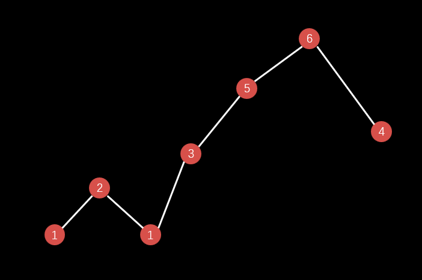
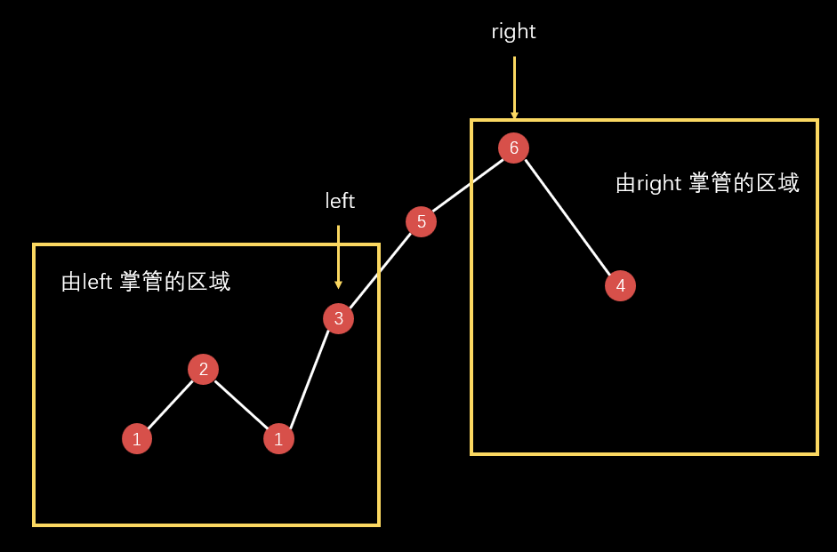
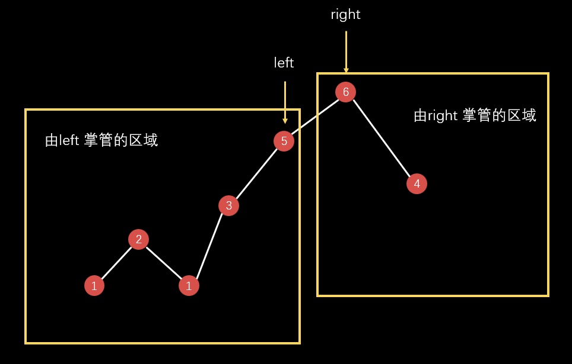

# [162 Find Peak Element](https://leetcode.cn/problems/find-peak-element)

A peak element is an element that is strictly greater than its neighbors.

Given a **0-indexed** integer array `nums`, find a peak element, and return its index. If the array contains multiple peaks, return the index to **any of the peaks**.

You may imagine that `nums[-1] = nums[n] = -∞`. In other words, an element is always considered to be strictly greater than a neighbor that is outside the array.

You must write an algorithm that runs in `O(log n)` time.

 

**Example 1:**

```
Input: nums = [1,2,3,1]
Output: 2
Explanation: 3 is a peak element and your function should return the index number 2.
```

**Example 2:**

```
Input: nums = [1,2,1,3,5,6,4]
Output: 5
Explanation: Your function can return either index number 1 where the peak element is 2, or index number 5 where the peak element is 6.
```

 

**Constraints:**

- `1 <= nums.length <= 1000`
- `-231 <= nums[i] <= 231 - 1`
- `nums[i] != nums[i + 1]` for all valid `i`.


## 解法一：二分查找

首先我们看到示例

```
nums = [1, 2, 1, 3, 5, 6, 4]
```

这样看似乎有点不直观，我们不妨将数组 `nums` 用坐标系表示出来，于是它就变成了这样。



我们需要用到两个“指针”

- **left** 左”指针“（我们规定， **left** 左边的区域（包括 **left**）满足条件 **S**）
- **right** 右”指针“（同理，**right** 右边的区域（包括 **right**）不满足条件 **S**（即满足 **!S**））

开始的时候 **left** 和 **right** 分别指向数组的 **-1** 和 **n** 索引位置上，即这两个“指针”不指向数组中的任何数。

> 为什么要这样做？因为我们上面规定 **left** 左边的区域（包括 **left**）会满足条件 **S**，如果我们这时候将 **left** 指向数组的 0 位置或其他位置的元素上，就代表这个元素左边的区域（包括这个元素）满足条件 **S**，这明显不符合逻辑，我们都还没有开始搜索，怎么会有一个区域就满足条件了呢，所以用我们上述的思想来说，需要将 **left** 置于 **-1**。**right** 同理。开始的时候它们所代表的区域均为空集。

我们现在来定下这个条件 **S**，**（条件 S 可以为函数调用，可以很复杂，多复杂都行）**

$$S=（nums[mid] < nums[mid+1]）$$（后面解释为什么这么定条件 **S**）

如果满足该条件，就将 **left** 拓阔到 **mid**。这相当于 **left** 所掌管的区域的最右边一个数是小于这个区域的右边那个数，**right** 同理。如下图所示。



```go
if nums[mid] < nums[mid+1] {
    l = mid
} else {
    r = mid
}
```

**left** 区域满足 `nums[left] < nums[left + 1]`

**right** 区域满足 `nums[right] > nums[right + 1]`

> 这里 **right** 区域根据上述 **!S** 的条件来说，应该是 **right** 区域满足 `nums[right] >= nums[right + 1]`，但是题中已经说明相邻两个数不可能相等，所以可以等价于 **right** 区域满足 `nums[right] > nums[right + 1]`

因为我们搜索是由条件 **S** 与 **!S** 来拓宽区域的，所以一定会搜索完毕（并不会陷入死循环）

**当 `left + 1 = right` 的时候，就代表区域已经搜索完毕。**



我们可以发现，**由于条件 S 的约束**。

最后搜索到的 **left** 区域一定满足`nums[left] < nums[left + 1]`

最后搜索到的 **right** 区域一定满足`nums[right] > nums[right + 1]`

此时 **left + 1 = right**，就代表 `nums[right] > nums[right - 1]`，`nums[right] > nums[right + 1]`，这刚好就是我们所需要找的峰值（极值）点。


### 完善二分查找

我们看到条件 **S** 用到了 **mid** 和 **mid + 1** 当我们 **mid** 指向数组的最后一个元素的时候， **mid + 1**会导致访问越界。所以针对上述算法，我们对 **mid = n - 1** 的时候进行优化。

题目中规定，`nums[-1] = nums[n] = -∞`。

所以我们一开始对于 `left = -1` 的时候，要注意了，它这个区域里面包含一个数-∞，它是不是满足条件 **S**，我们验证一下，其满足 **S**，所以 **left** 初始值定为 -1 没问题。

对于 **right**，它一开始也包含一个数负无穷，它包含的区域是不是满足 **!S** 呢，判断不了，因为并没有 **nums[n + 1]**，但是我们发现 `nums[n - 1]` 是一定大于 -∞ 的，所以 **right** 一开始就可以定在 n - 1 上，即 `right = n - 1`，这样也把 `mid = n - 1` 的情况给优化了。


所以完整代码如下

```go
func findPeakElement(nums []int) int {
	l, r := -1, len(nums)-1
	for l+1 != r {
		mid := (r-l)/2 + l
		if nums[mid] < nums[mid+1] {
			l = mid
		} else {
			r = mid
		}
	}
	return r
}
```

> 时间复杂度：$O(logn)$
>
> 空间复杂度：$O(1)$