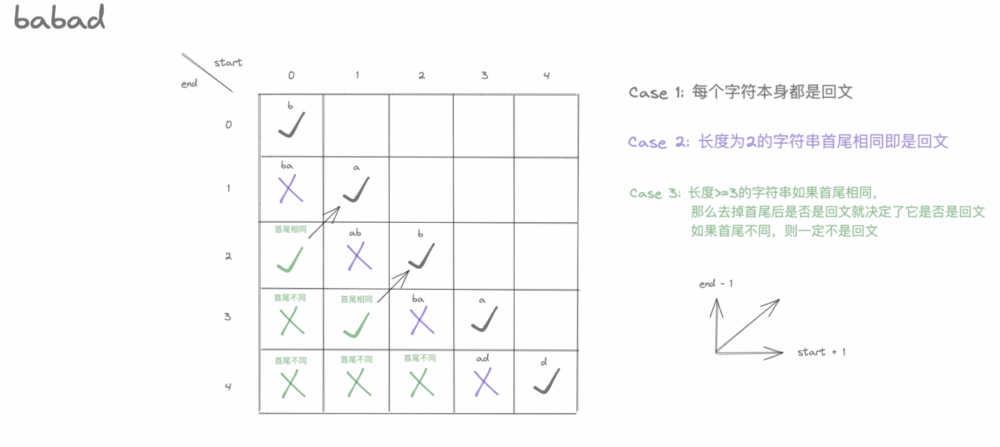

> [LeetCode 5][https://leetcode.cn/problems/longest-palindromic-substring]

# 解法：动态规划

规定 `dp[i][j]` ( $i <= j$ ) 表示字符串 $s$ 的第 $i$ 到 $j$ 个字母组成的子串是否为回文串。

易得递推公式

`dp[i][j] = d[i + 1][j - 1] && s[i] == s[j]`

意思是，只要我中间的字符串是回文串，则我只需要保证我两头字符相等，则我也是回文串。如果我中间的部分不是回文串，那我绝对不是回文串。

（这里借用 https://leetcode.cn/problems/longest-palindromic-substring/solutions/1348874/s-by-xext-5zk3/ 的图。）



当前状态由右上角的状态推得，所以我们需要先初始化两个斜对角线，然后再开始以斜对角线的方式推状态。在推的时候我们需要记录最长的回文串。

```go
func longestPalindrome(s string) string {
	n := len(s)
	dp := make([][]bool, n)
	// 初始化第一条对角线
	for i := 0; i < n; i++ {
		dp[i] = make([]bool, n)
		dp[i][i] = true
	}

	// 初始化第二条对角线
	ans := string(s[0])
	for i := 0; i < n-1; i++ {
		if s[i] == s[i+1] {
			dp[i][i+1] = true
			ans = s[i : i+2]
		}
	}

	// 递推（以斜对角线递推）
	for step := 2; step <= n; step++ {
		for i := 0; i < n-step; i++ {
			dp[i][i+step] = dp[i+1][i+step-1] && s[i] == s[i+step]
			// 如果该字串是回文串并且长度大于之前所记录的最长长度，则更新 ans
			if dp[i][i+step] && step+1 > len(ans) {
				ans = s[i : i+step+1]
			}
		}
	}

	return ans
}
```

> 时间复杂度：$O(n^2)$
>
> 空间复杂度：$O(n^2)$